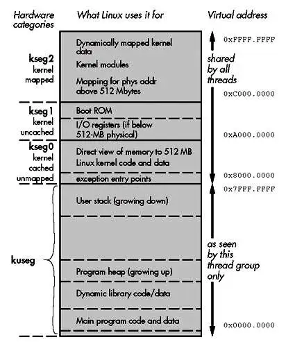

# Address Translation in Linux/MIPS Systems

> [Credits](https://www.embedded.com/getting-down-to-basics-running-linux-on-a-32-64-bit-risc-architecture-part-3/)

## Overview of Memory Mapping
The memory map for a Linux thread on a 32-bit Linux/MIPS system is designed to fit within the constraints of the MIPS hardware architecture. The user-accessible memory, which is where applications run, occupies the lower half of this virtual address space. This setup is also the foundation for the 64-bit version, although it introduces more complexity due to the hardware's capabilities.

### Key Points to Consider
1. **Kernel Execution Space**: The Linux kernel for MIPS is designed to run in a specific segment of memory known as `kseg0`. This starts at virtual address `0x8000.0000`. This region directly maps to the first 512 MB of physical memory without needing Translation Lookaside Buffer (TLB) management, making kernel operations more efficient.

2. **Exception Handling**: Traditionally, MIPS CPUs have their exception entry points near the start of `kseg0`. Newer designs might allow for relocation of these points to accommodate different CPU configurations sharing memory, although Linux typically uses a unified exception handling code across all CPUs.

3. **User Space for Applications**: Applications in Linux/MIPS run in user mode with addresses ranging from `0` to `0x7FFF.FFFF`. Here, memory is accessed through the TLB, ensuring that each process has its own isolated memory space. Notably, the main program starts near zero, but not at zero to avoid null pointer exceptions.

4. **Memory Growth and Management**: The user stack grows downwards from the top of the user space, while the heap, which might include dynamically linked libraries or allocated memory via functions like `malloc()`, grows upwards. This dual growth ensures efficient use of the available 2 GB of user space, though very large applications or servers might push this limit.

5. **Handling More Than 512 MB of Physical Memory**: For systems with more than 512 MB of RAM, addressing becomes more complex. Linux introduces the concept of "high memory," which requires special handling and mapping through the TLB when accessed.

### Detailed Address Translation Mechanism
- **Dynamic Mapping**: The kernel dynamically maps memory for its modules and physical address space above 512 MB into the virtual space, ensuring that even if physical memory exceeds the direct mapping capabilities of `kseg0` and `kseg1`, it can still be utilized efficiently.

- **Cache and Uncached Access**: Physical memory up to 512 MB can be accessed in a cached manner through `kseg0` and uncached through `kseg1`. This dual access mode helps in managing performance versus consistency trade-offs depending on the operation's needs.

- **TLB and High Memory Access**: For accessing memory beyond the 512 MB mark, the system might need to set up TLB entries dynamically, allowing the CPU to fetch and translate these addresses on demand.

### Historical Context and Evolution
The design of MIPS memory management was influenced by early UNIX systems, particularly the VAX architecture, known for its pioneering role in virtual memory systems. However, MIPS takes a more minimalist approach, relying heavily on software for tasks that other architectures might handle in hardware, reflecting its RISC (Reduced Instruction Set Computing) philosophy.

### Diagrammatic Representation
To visualize how these segments interact and are utilized, consider a simplified diagram where:
- **kseg0** and **kseg1** handle kernel operations and memory access.
- **User Space** contains application code, heap, and stack, dynamically growing as needed.
- **High Memory** requires special handling for access beyond the direct mapped regions.

This structured approach to memory management in Linux/MIPS systems ensures efficient use of both hardware capabilities and software flexibility, crucial for performance and stability in both embedded and larger computing environments.