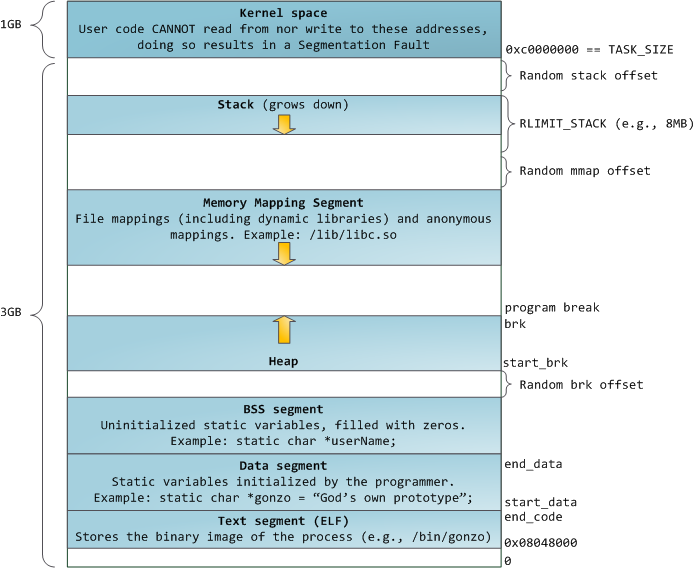

## Does memory mapping segment and heap grow until they meet each other?

>This question can come to anyone's mind who is trying to understand the memory structure.

> [Credits](https://i.sstatic.net/epGfE.png)

#### **RLIMIT_AS**

- **Purpose**: RLIMIT_AS sets the maximum size of the process's virtual address space in bytes. 
  - **Scope**: This limit applies to all types of memory allocation within the process, including:
    - The stack.
    - The heap (via `brk`).
    - Memory mapped regions (`mmap`).
    - Shared libraries.
  - **Behavior**: If an allocation would exceed this limit, it fails with an error or might result in the termination of the process.

#### **RLIMIT_DATA**

- **Purpose**: RLIMIT_DATA restricts the maximum size of the data segment.
  - **Components**: This segment includes:
    - Initialized data (data section).
    - Uninitialized data (bss section).
    - Heap memory managed by `brk` and `sbrk`.
  - **Expansion**: Since Linux 4.7, this limit also affects `mmap` operations, influencing how much memory can be allocated for data.
  - **Error Handling**: If these limits are exceeded, operations like `brk()` will fail with ENOMEM.

#### **Kernel's Role in Memory Management**

- **Limit Checks**: The kernel continuously monitors:
    - Stack expansion.
    - `mmap` calls.
    - `brk` system calls (heap allocation).
  - **Conflict Prevention**: The kernel ensures that different memory segments do not overlap or conflict:
    - Checks are performed during heap allocation to prevent overwriting existing segments.
    - If a conflict is detected, the allocation fails or the process is terminated (e.g., with SIGSEGV for stack overflow).

#### **Shared Memory Segment Growth**

- **Memory Layout**: The growth direction of shared memory segments depends on the system's memory layout:
  - **Legacy Layout**: Uses bottom-up allocation, starting from `TASK_UNMAPPED_BASE`.
  - **Non-Legacy Layout**: Employs top-down allocation.
  - **Determination**: Functions like `arch_pick_mmap_layout()` and `mmap_is_legacy()` (on x86) decide this behavior.
- **Switching Layouts**: You can switch to legacy mode using `setarch -L`.

#### **Observing Segment Growth**

- **Tool**: The `/proc/$$/maps` file provides a snapshot of the process's memory layout:
  - **Bottom-Up vs. Top-Down**: 
    - If the dynamic linker (`ld-linux`) has a lower address than subsequent libraries, it indicates bottom-up allocation.
    - Otherwise, it's top-down.
  - **Practical Example**: Comparing `cat /proc/self/maps` with `setarch x86_64 -L cat /proc/self/maps` can show the effect of switching between allocation strategies.
