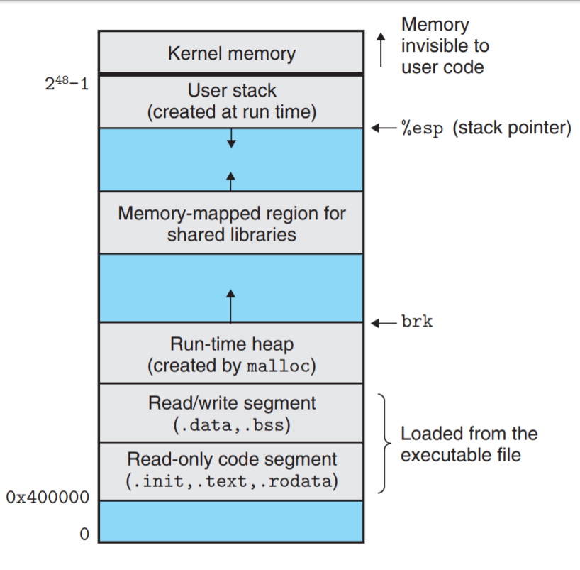

## Instruction Address Placement in Linux Process Memory Layout

Let's consider a simple program like below:
```c
#include <stdio.h>
void iLoveU()
{
    // doing nothing
}

int main()
{
    printf("%p", &iLoveU);
    return 0;
}
```

Once you will compile and run the above code you will find the below output:
```bash
0x5b70f2e42149%
```

This will really trigger a question in your mind that:
* Why this programing gave the `0x5b702f42149%` as the address.
* Because our code should be available in the `.text` segment.

Also, according to the below image (taken from **CS:APP**)


The address of the `iLoveU` should be near the starting address of `.text` segment which is around `0x4000000..`, but this address is stored in the middle somwhere.
Local variables stored on the stack have addresses near `2^48 - 1`.


When GCC is configured with `--enable-default-pie` (which is now the default), it generates Position Independent Executables (PIE). This means the actual load address of the program differs from the compile-time linker-specified address (0x400000 for x86_64). This is a security feature to support Address Space Layout Randomization (ASLR). Essentially, GCC uses the `-pie` option by default during compilation.

If you compile with `-no-pie` (e.g., `gcc -no-pie file.c`), you'll observe the address of functions closer to 0x400000. 

On my setup, I get:

```bash
$ gcc -no-pie instruction_process_memory_layout.c
$ ./a.out 
0x401136%
```

You can confirm the load address using `readelf`:

```bash
$ readelf -Wl pl.out | grep LOAD

LOAD           0x000000 0x0000000000400000 0x0000000000400000 0x000500 0x000500 R   0x1000
LOAD           0x001000 0x0000000000401000 0x0000000000401000 0x00017d 0x00017d R E 0x1000
LOAD           0x002000 0x0000000000402000 0x0000000000402000 0x00010c 0x00010c R   0x1000
LOAD           0x002e10 0x0000000000403e10 0x0000000000403e10 0x000220 0x000228 RW  0x1000
```

You can check if `--enable-default-pie` is enabled by using `gcc --verbose`.

You might also see that the address printed by your program changes with each execution due to ASLR. To disable ASLR for testing purposes, you can use:

```bash
$ echo 0 | sudo tee /proc/sys/kernel/randomize_va_space
```

`ASLR` is enabled by default on Linux systems.

**References:**
- [GCC Documentation on PIE](https://gcc.gnu.org/onlinedocs/gcc-11.2.0/gcc/Code-Gen-Options.html#index-fPIE)
- [Linux Kernel Documentation on ASLR](https://www.kernel.org/doc/html/latest/admin-guide/sysctl/kernel.html#randomize-va-space)
                                                                                               │  LOAD           0x001000 0x0000000000401000 0x0000000000401000 0x00017d 0x00017d R E 0x100
